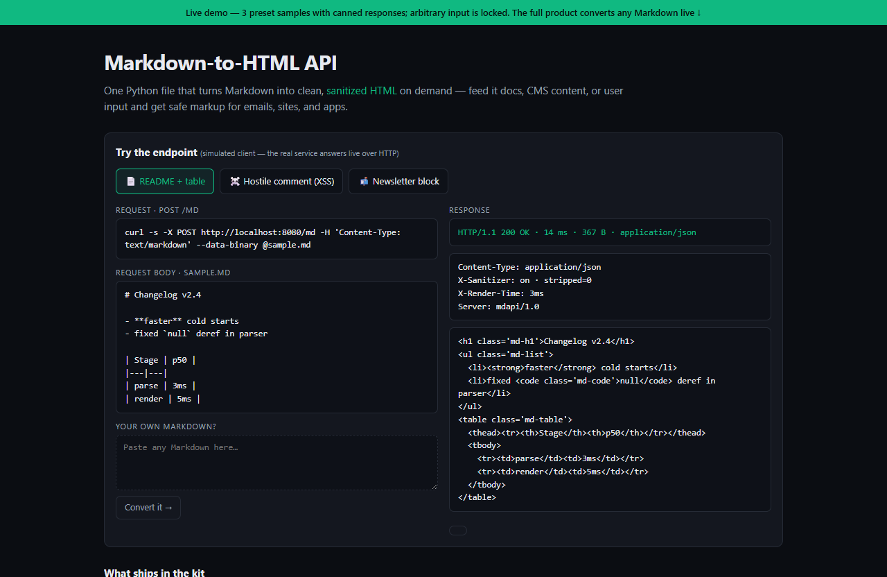

# Markdown-to-HTML API — live demo

  

  <a href="https://amos-mig.github.io/markdown-to-html-api-demo/"><strong>▶ Open the live demo</strong></a> ·
  <a href="https://amosmign.gumroad.com/l/markdown-to-html-api"><strong>Get the full product · €29</strong></a>

## What this is

An in-browser simulation of the Markdown-to-HTML API: three preset samples (docs table, hostile XSS comment, newsletter block) return canned sanitized responses with status line, headers and latency, plus a toggle between HTML source and rendered preview. Locked feature cards and a partial deploy snippet tease the rest of the paid kit.

**Try it:** Click the sample tabs to send a request, flip between HTML source and rendered output, then paste your own Markdown to see the live-conversion lock.

## What you get in the full product

- Converts standard Markdown (headings, tables, code, lists)
- Output sanitized against XSS injection
- Consistent, styleable HTML classes for easy theming
- Useful for docs pipelines, email templates, and CMS backends
- Single Python file with minimal dependencies

## About

- **Storefront:** [kits.amosmignery.dev](https://kits.amosmignery.dev) — single-file products, instant download, commercial license
- **Checkout:** [Gumroad](https://amosmign.gumroad.com/l/markdown-to-html-api) (Merchant of Record, VAT handled)
- **Full product:** [Markdown-to-HTML API](https://amosmign.gumroad.com/l/markdown-to-html-api) · €29

## License

The demo page in this repo is MIT-licensed — reuse the technique, not the product.
The **Markdown-to-HTML API** itself is not included here and is not free software.
